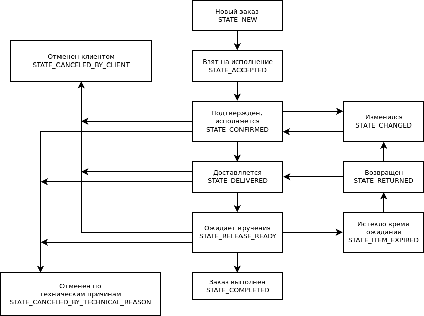

Реализация state machine для изменения статуса заказа в интернет магазине.

Инициализация:

```php

$order = new \Domain\Order();

$stateSwitcher = new \Domain\OrderStateSwitcher($order);

// Берем на исполнение
$stateSwitcher->hasAccepted();

// Клиент подтвердил намерение покупки
$stateSwitcher->hasConfirmed();

// В данный момент бросится исключение
// т.к. заказ не прошел промежуточные состояния
$stateSwitcher->hasCompleted();

```

Схема state flow:

